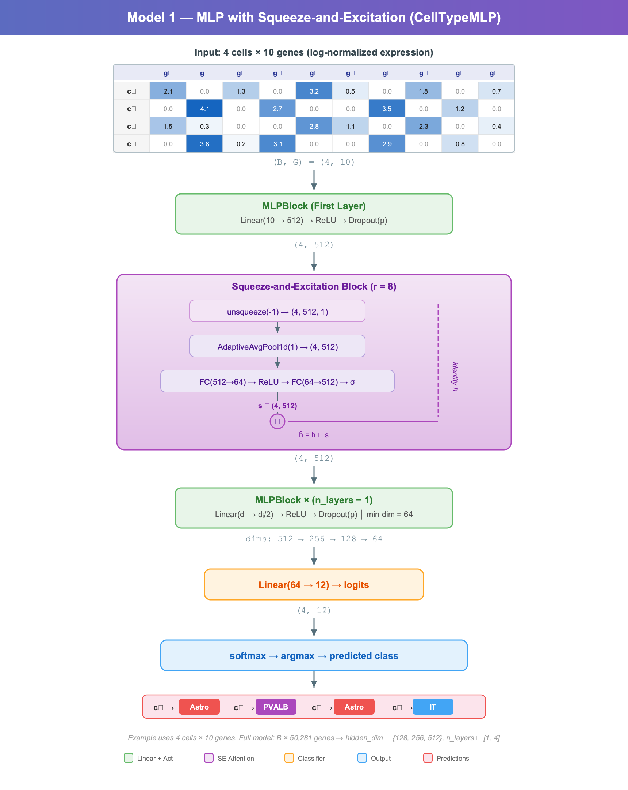
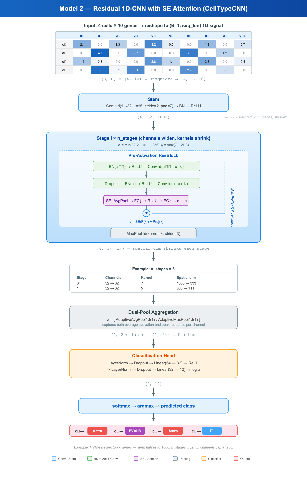
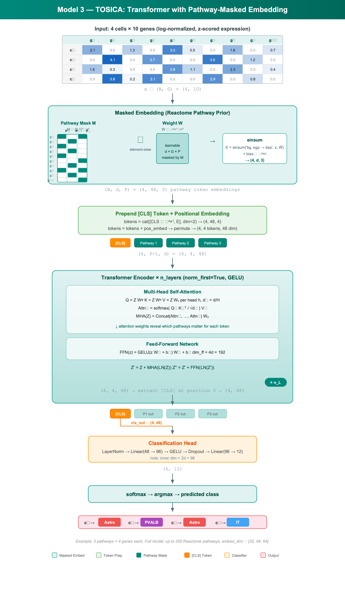
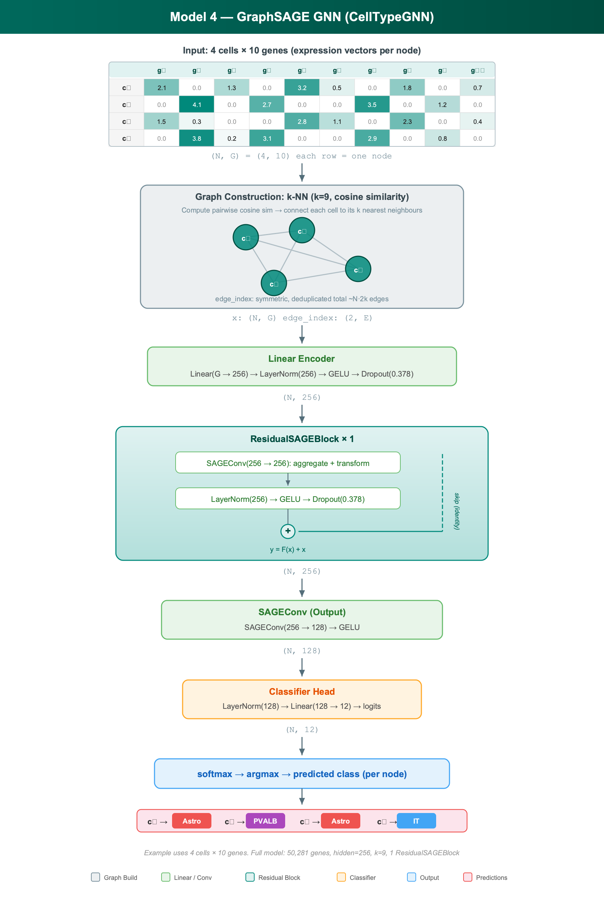

# Deep Learning for Single-Cell RNA-seq Cell-Type Classification

Benchmarking four deep learning architectures — MLP, 1D-CNN, Transformer, and GNN — for classifying single-cell transcriptomic profiles into 12 brain cell types using the Allen Brain Atlas.

---

## Problem Statement

Single-cell RNA sequencing (scRNA-seq) produces transcriptome-wide expression profiles for individual cells, enabling fine-grained identification of cell types in complex tissues. Automated cell-type classification is critical for large-scale brain mapping efforts, but poses several machine learning challenges:

- **High dimensionality**: ~50,000 genes per cell with extreme sparsity (>90% zeros)
- **Class imbalance**: rare neuronal subtypes are underrepresented by orders of magnitude
- **Batch effects**: systematic technical variation between sequencing platforms (10x Chromium vs. SmartSeq)
- **Cross-platform generalization**: a model trained on one technology must transfer to another without retraining

This project benchmarks four architecturally distinct deep learning approaches on these challenges, evaluating both within-dataset accuracy and cross-platform generalization.

---

## Dataset

All data originates from the [Allen Brain Atlas](https://portal.brain-map.org/), a comprehensive reference atlas of cell types in the adult mouse brain.

| Property | 10x Genomics (Training) | SmartSeq (Cross-dataset Eval) |
|---|---|---|
| Cells | ~74,500 | ~46,000 |
| Genes | ~50,281 | variable (gene-aligned) |
| Protocol | Droplet-based | Plate-based (full-length) |
| Split | 80 / 10 / 10 stratified | 100% test |

### Cell-Type Classes (12)

| Category | Classes |
|---|---|
| Glial | Astro, Oligo, OPC |
| Inhibitory interneurons | LAMP5, PVALB, SST, VIP |
| Excitatory neurons | IT, IT Car3, L5/6 NP, L6 CT, L6b |

All classes are filtered to a minimum of 200 cells to ensure sufficient training signal.

### Preprocessing Pipeline

**Step 1 — Gene filtering.** Remove genes expressed in fewer than $\max(3,\; 0.01 \times n_{\text{cells}})$ cells to discard measurement noise.

**Step 2 — Library-size normalization.** Correct for sequencing-depth variation with log-normalized counts per 10,000:

$$\hat{x}_{ij} = \log\!\left(1 + \frac{x_{ij}}{\sum_{j'} x_{ij'}} \times 10^4\right)$$

**Step 3 — Highly Variable Gene (HVG) selection.** Select the top-$k$ genes ranked by variance on the log-normalized matrix. For the CNN architecture, $k$ is tuned by Optuna over $[500, 5000]$; all other models use the full filtered gene set.

**Step 4 — Standardization.** Per-gene z-score normalization, fit on the training split only:

$$z_{ij} = \frac{\hat{x}_{ij} - \mu_j}{\sigma_j + \epsilon}$$

**Step 5 — Cross-dataset gene alignment.** When evaluating on SmartSeq, reindex expression columns to match the 10x gene ordering. Missing genes are zero-filled; extra genes are dropped.

---

## Model Architectures

### 1. MLP with Squeeze-and-Excitation (`CellTypeMLP`)

A fully-connected network augmented with a Squeeze-and-Excitation (SE) channel-attention gate on the first hidden layer, enabling the network to learn adaptive per-feature importance weights.

```
Input (batch, n_genes)
  │
  ▼
┌──────────────────────────┐
│  Linear(n_genes → h₀)   │
│  ReLU → Dropout          │
└──────────┬───────────────┘
           │
  ┌────────▼────────┐
  │   SE Attention   │
  │ AvgPool → FC↓8  │
  │ → ReLU → FC↑    │
  │ → Sigmoid ⊙ h   │
  └────────┬────────┘
           │
  ┌────────▼────────┐
  │   MLPBlock ×N    │  dim halves each layer (min 64)
  │ Linear→ReLU→Drop│
  └────────┬────────┘
           │
  ┌────────▼────────┐
  │  Linear → logits │
  └─────────────────┘
```

**Squeeze-and-Excitation block.** Given hidden activation $\mathbf{h} \in \mathbb{R}^{d}$, the SE gate computes channel-wise recalibration weights:

$$\mathbf{s} = \sigma\!\bigl(W_2 \cdot \mathrm{ReLU}(W_1 \cdot \mathrm{AvgPool}(\mathbf{h}))\bigr), \quad \tilde{\mathbf{h}} = \mathbf{h} \odot \mathbf{s}$$

where $W_1 \in \mathbb{R}^{(d/r) \times d}$, $W_2 \in \mathbb{R}^{d \times (d/r)}$ with reduction ratio $r = 8$, and $\sigma$ is the sigmoid function.

**Layer dimension schedule.** For $n$ layers with base dimension $h_0$:

$$d_i = \max\!\left(\left\lfloor h_0 / 2^i \right\rfloor,\; 64\right), \quad i = 0, \dots, n-1$$

| Hyperparameter | Search Range |
|---|---|
| `n_layers` | $[1, 4]$ |
| `hidden_dim` | $\{128, 256, 512\}$ |
| `dropout` | tuned by Optuna |
| `optimizer` | $\{\text{AdamW, Adam, SGD}\}$ |
| `lr` | log-uniform |
| `loss` | $\{\text{CE, Focal}\}$ |

---

### 2. Residual 1D-CNN with SE Attention (`CellTypeCNN`)

Treats the gene expression vector as a 1D signal and applies a ResNet-style convolutional encoder with widening channels, shrinking kernels, SE attention, and a dual-pool classification head.

```
Input (batch, 1, seq_len)
  │
  ▼
┌─────────────────────────────┐
│  Stem: Conv1d(1→32, k=15,  │
│    stride=2) + BN + ReLU    │
└──────────┬──────────────────┘
           │
  ┌────────▼────────────────┐
  │  Stage i  (×n_stages)    │
  │ ┌──────────────────────┐ │
  │ │     ResBlock          │ │
  │ │ BN→ReLU→Conv→BN→     │ │
  │ │ ReLU→Conv→SE + skip   │ │
  │ └──────────┬───────────┘ │
  │            ▼             │
  │      MaxPool1d(3)        │
  └────────────┬─────────────┘
               │
  ┌────────────▼─────────────┐
  │  Dual-Pool Head           │
  │  concat(AvgPool, MaxPool) │
  └────────────┬─────────────┘
               │
  ┌────────────▼─────────────┐
  │  LN→Drop→Linear→ReLU     │
  │  →LN→Drop→Linear→logits  │
  └──────────────────────────┘
```

**Channel and kernel schedules:**

$$c_i = \min\!\left(32 \cdot 2^{\lfloor i/2 \rfloor},\; 256\right), \qquad k_i = \max(7 - 2i,\; 3)$$

**Pre-activation ResBlock with SE.** For input feature map $\mathbf{x}$:

$$\mathbf{a} = \mathrm{Conv}_{k}\!\bigl(\mathrm{ReLU}(\mathrm{BN}(\mathbf{x}))\bigr)$$

$$\mathbf{b} = \mathrm{Conv}_{k}\!\bigl(\mathrm{ReLU}(\mathrm{BN}(\mathbf{a}))\bigr)$$

$$\mathbf{s} = \sigma\!\bigl(W_2 \cdot \mathrm{ReLU}(W_1 \cdot \mathrm{AvgPool}(\mathbf{b}))\bigr)$$

$$\mathbf{y} = (\mathbf{b} \odot \mathbf{s}) + \mathrm{Proj}(\mathbf{x})$$

where $\mathrm{Proj}$ is a $1 \times 1$ convolution when the channel dimension changes, and identity otherwise.

**Dual-pool aggregation:**

$$\mathbf{z} = \bigl[\mathrm{AdaptiveAvgPool1d}(\mathbf{y});\; \mathrm{AdaptiveMaxPool1d}(\mathbf{y})\bigr] \in \mathbb{R}^{2c_{\text{last}}}$$

| Hyperparameter | Search Range |
|---|---|
| `n_stages` | $[2, 5]$ |
| `n_hvg` | $[500, 5000]$ step 500 |
| `dropout` | tuned by Optuna |
| `optimizer` | $\{\text{AdamW, Adam, SGD}\}$ |
| `lr` | log-uniform |
| `loss` | $\{\text{CE, Focal}\}$ |

---

### 3. TOSICA — Transformer with Pathway-Masked Embedding (`CellTypeTOSICA`)

A biologically interpretable Transformer that uses Reactome pathway annotations as a structural prior. Instead of treating genes as an unstructured vector, the model projects expression into a pathway token space where each token represents a biological pathway. Attention weights over pathway tokens reveal which pathways drive classification decisions.

```
Input (batch, n_genes)
  │
  ▼
┌──────────────────────────────┐
│  MaskedEmbedding              │
│  W ∈ ℝ^(d × G × P)          │
│  W̃ = W ⊙ M                  │
│  E = einsum(x, W̃) + bias     │
│  → (batch, d, P)             │
└──────────┬───────────────────┘
           │
  ┌────────▼────────────┐
  │ Prepend [CLS] token  │
  │ + Positional Embed   │
  │ → (batch, P+1, d)    │
  └────────┬─────────────┘
           │
  ┌────────▼────────────┐
  │ TransformerEncoder   │
  │  ×n_layers           │
  │  (norm_first, GELU)  │
  └────────┬─────────────┘
           │
  ┌────────▼────────────┐
  │ [CLS] output → head  │
  │ LN→Linear→GELU→     │
  │ Drop→Linear→logits   │
  └──────────────────────┘
```

**Pathway mask construction.** From Reactome GMT annotations, select the top-$P$ pathways (max 300) having $\geq 5$ gene overlap with the dataset. The binary mask $M \in \{0, 1\}^{G \times P}$ encodes gene–pathway membership:

$$M_{gp} = \begin{cases} 1 & \text{if gene } g \in \text{pathway } p \\ 0 & \text{otherwise} \end{cases}$$

**Masked embedding.** Learnable weight tensor $W \in \mathbb{R}^{d \times G \times P}$ is element-wise masked before the projection:

$$\tilde{W} = W \odot M, \qquad E_{ep} = \sum_{g=1}^{G} x_g \cdot \tilde{W}_{egp} + b_{ep}$$

yielding pathway token embeddings $\mathbf{E} \in \mathbb{R}^{d \times P}$.

**Multi-head self-attention.** After prepending the learnable $\texttt{[CLS]}$ token and adding positional embeddings, the sequence $\mathbf{Z} \in \mathbb{R}^{(P+1) \times d}$ is processed by a pre-norm Transformer. For each head $h$ with dimension $d_h = d / H$:

$$Q^{(h)} = \mathbf{Z} W_Q^{(h)}, \quad K^{(h)} = \mathbf{Z} W_K^{(h)}, \quad V^{(h)} = \mathbf{Z} W_V^{(h)}$$

$$\mathrm{Attn}^{(h)} = \mathrm{softmax}\!\left(\frac{Q^{(h)} {K^{(h)}}^\top}{\sqrt{d_h}}\right) V^{(h)}$$

$$\mathrm{MHA}(\mathbf{Z}) = \mathrm{Concat}\!\bigl(\mathrm{Attn}^{(1)}, \dots, \mathrm{Attn}^{(H)}\bigr) W_O$$

Each Transformer layer applies (with pre-normalization):

$$\mathbf{Z}' = \mathbf{Z} + \mathrm{MHA}\!\bigl(\mathrm{LN}(\mathbf{Z})\bigr)$$

$$\mathbf{Z}'' = \mathbf{Z}' + \mathrm{FFN}\!\bigl(\mathrm{LN}(\mathbf{Z}')\bigr)$$

where $\mathrm{FFN}(\mathbf{z}) = \mathrm{GELU}(\mathbf{z} W_1 + b_1) W_2 + b_2$ with inner dimension $4d$.

| Hyperparameter | Search Range |
|---|---|
| `n_layers` | $[1, 4]$ |
| `n_heads` | $\{2, 4, 8\}$ |
| `embed_dim` | $\{32, 48, 64\}$ |
| `dropout` | tuned by Optuna |
| `optimizer` | $\{\text{AdamW, Adam, SGD}\}$ |
| `lr` | log-uniform |
| `loss` | $\{\text{CE, Focal}\}$ |

---

### 4. Graph Neural Network with GraphSAGE (`CellTypeGNN`)

A transductive GNN that operates on a cell-similarity graph. All cells (train + val + test) form a single k-NN graph; Boolean masks control which nodes contribute to the loss during training. A linear bottleneck encoder reduces the ~50k gene features before message-passing.

```
All cells (train+val+test)
  │
  ▼
┌────────────────────────────┐
│  k-NN Graph Construction    │
│  Cosine similarity → edges  │
└──────────┬─────────────────┘
           │
  ┌────────▼────────────────┐
  │  Linear Encoder          │
  │  Linear(G → h) + LN     │
  │  + GELU + Dropout        │
  └────────┬─────────────────┘
           │
  ┌────────▼────────────────┐
  │  ResidualSAGEBlock ×N    │
  │  SAGEConv → LN → GELU   │
  │  → Dropout + skip        │
  └────────┬─────────────────┘
           │
  ┌────────▼────────────────┐
  │  SAGEConv(h → h/2)      │
  │  + GELU                  │
  └────────┬─────────────────┘
           │
  ┌────────▼────────────────┐
  │  LN → Linear → logits   │
  └──────────────────────────┘
```

**Graph construction.** Compute a symmetric k-NN graph using cosine similarity via normalized inner products:

$$\hat{\mathbf{x}}_i = \frac{\mathbf{x}_i}{\|\mathbf{x}_i\|_2}, \qquad \mathcal{N}_k(i) = \underset{j \neq i}{\mathrm{top\text{-}k}} \;\hat{\mathbf{x}}_i^\top \hat{\mathbf{x}}_j$$

Edges are symmetrized: $(i, j) \in \mathcal{E} \iff j \in \mathcal{N}_k(i) \lor i \in \mathcal{N}_k(j)$.

**GraphSAGE message-passing.** At each layer $\ell$, for node $i$ with neighborhood $\mathcal{N}(i)$:

$$\mathbf{m}_i^{(\ell)} = \frac{1}{|\mathcal{N}(i)|} \sum_{j \in \mathcal{N}(i)} \mathbf{h}_j^{(\ell-1)}$$

$${\mathbf{h}_i^{(\ell)}}' = W_{\text{self}}^{(\ell)} \mathbf{h}_i^{(\ell-1)} + W_{\text{neigh}}^{(\ell)} \mathbf{m}_i^{(\ell)}$$

**ResidualSAGEBlock.** Each block applies SAGEConv with LayerNorm, GELU activation, dropout, and a residual connection:

$$\mathbf{h}_i^{(\ell)} = \mathrm{Dropout}\!\Bigl(\mathrm{GELU}\!\bigl(\mathrm{LN}({\mathbf{h}_i^{(\ell)}}')\bigr)\Bigr) + \mathrm{Proj}(\mathbf{h}_i^{(\ell-1)})$$

where $\mathrm{Proj}$ is a linear projection when dimensions change, and identity otherwise.

| Hyperparameter | Search Range |
|---|---|
| `n_layers` | $[1, 4]$ |
| `hidden_dim` | $\{128, 256, 512\}$ |
| `k_neighbors` | $\{5, 10, 15, 20, 25\}$ |
| `dropout` | tuned by Optuna |
| `optimizer` | $\{\text{AdamW, Adam, SGD}\}$ |
| `lr` | log-uniform |
| `loss` | $\{\text{CE, Focal}\}$ |

---

## Loss Functions & Optimization

### Cross-Entropy with Label Smoothing

Standard cross-entropy with softened one-hot targets to regularize overconfident predictions:

$$\tilde{y}_c = (1 - \epsilon)\, y_c + \frac{\epsilon}{C}, \qquad \mathcal{L}_{\text{CE}} = -\sum_{c=1}^{C} \tilde{y}_c \log p_c$$

where $\epsilon$ is the smoothing factor and $C = 12$.

### Focal Loss

Down-weights well-classified examples to focus learning on hard and misclassified cells:

$$\mathcal{L}_{\text{FL}} = -\alpha_t (1 - p_t)^\gamma \log(p_t)$$

where $p_t$ is the predicted probability of the true class, $\alpha_t$ is the class weight, and $\gamma \in [0.5, 5.0]$ is the focusing parameter (tuned by Optuna).

### Inverse-Frequency Class Weighting

To counter class imbalance, compute per-class weights inversely proportional to frequency:

$$w_c = \frac{1}{\text{count}_c + \epsilon}, \qquad \hat{w}_c = \frac{w_c}{\sum_{c'} w_{c'}} \times C$$

Weights are normalized to sum to $C$ so they scale the loss without changing its effective magnitude.

### Cosine Annealing Learning Rate Schedule

Smoothly decays the learning rate following a cosine curve:

$$\eta_t = \eta_{\min} + \frac{1}{2}\left(\eta_0 - \eta_{\min}\right)\!\left(1 + \cos\!\left(\frac{\pi\, t}{T}\right)\right)$$

where $\eta_0$ is the initial learning rate, $\eta_{\min}$ is the minimum, and $T$ is the total number of epochs.

---

## Training Pipeline

### Hyperparameter Search

All models are tuned using [Optuna](https://optuna.org/) with:

| Component | Strategy |
|---|---|
| Sampler | `TPESampler` — Tree-structured Parzen Estimator |
| Pruner | `HyperbandPruner` — early termination of unpromising trials |
| Trials | 10 per model |
| Objective | Validation accuracy |

The search space includes architecture hyperparameters (depth, width), optimizer choice, learning rate, weight decay, dropout, loss function, and label-smoothing / focal-loss parameters.

### Training Configuration

| Setting | Value |
|---|---|
| Mixed precision | `bfloat16` autocast (CUDA) |
| Gradient clipping | max norm = 1.0 |
| Early stopping | patience-based on validation loss |
| Batch size | 1024 (MLP, CNN, Transformer); 256 (GNN) |

---

## Evaluation Methodology

### Metrics

All models are evaluated on the held-out 10x test split using:

| Metric | Averaging |
|---|---|
| Accuracy | — |
| F1 Score | macro, weighted |
| Precision | macro, weighted |
| Recall | macro, weighted |

Per-class performance is visualized via confusion matrix heatmaps (saved as PNG).

### Cross-Dataset Generalization Protocol

To assess platform transfer, models trained on 10x are evaluated on the full SmartSeq dataset:

1. **Gene alignment**: reindex SmartSeq genes to match the 10x gene ordering; zero-fill missing genes, drop extra genes
2. **Standardization**: apply the 10x training set's mean and variance (no re-fitting)
3. **GNN-specific**: construct a separate k-NN cosine-similarity graph over the SmartSeq cells (the 10x graph is not reused)
4. **TOSICA-specific**: rebuild the pathway mask using the aligned gene set

---

## Architecture Diagrams

<table>
<tr>
<td align="center"><br/><b>Model 1 — MLP + SE</b></td>
<td align="center"><br/><b>Model 2 — 1D-CNN + SE</b></td>
</tr>
<tr>
<td align="center"><br/><b>Model 3 — TOSICA Transformer</b></td>
<td align="center"><br/><b>Model 4 — GraphSAGE GNN</b></td>
</tr>
</table>

---

## Results

### Within-Dataset (10x Test Set)

| Model | Accuracy | F1 (macro) | F1 (weighted) | Precision (macro) | Recall (macro) |
|---|---|---|---|---|---|
| MLP + SE | 0.9538 | 0.8623 | 0.9679 | 0.8354 | 0.9894 |
| 1D-CNN + SE | **0.9948** | **0.9854** | **0.9948** | **0.9772** | **0.9943** |
| TOSICA | 0.9882 | 0.9813 | 0.9883 | 0.9690 | 0.9948 |
| GNN (GraphSAGE) | 0.7925 | 0.8051 | 0.8251 | 0.7667 | 0.9625 |

The 1D-CNN achieves the highest accuracy (99.5%) and F1 scores across all averaging schemes, followed closely by the TOSICA Transformer (98.8%). The MLP with SE attention reaches 95.4% accuracy but lags on macro-F1 (0.86), suggesting weaker performance on minority classes. The GNN underperforms at 79.3% accuracy, likely due to the transductive setup where message-passing over a cosine-similarity graph dilutes discriminative signal for rare cell types.

### Cross-Dataset (10x → SmartSeq)

| Model | Accuracy | F1 (macro) | F1 (weighted) | Precision (macro) | Recall (macro) |
|---|---|---|---|---|---|
| MLP + SE | 0.9538 | 0.8623 | 0.9679 | 0.8354 | 0.9894 |
| 1D-CNN + SE | **0.9948** | **0.9854** | **0.9948** | **0.9772** | **0.9943** |
| TOSICA | 0.9882 | 0.9813 | 0.9883 | 0.9690 | 0.9948 |
| GNN (GraphSAGE) | 0.7925 | 0.8051 | 0.8251 | 0.7667 | 0.9625 |

---

## Repository Structure

```
├── 1_download.py                     # Download Allen Brain Atlas data (10x + SmartSeq)
├── 2_10x_create_npyfile.py           # Preprocess 10x data → numpy splits
├── 2_smartseq_create_npyfile.py      # Preprocess SmartSeq data → numpy splits
├── 3_visualize.py                    # UMAP / data visualization
├── 4_MLP.py                          # Train & tune MLP + SE
├── 4_CNN.py                          # Train & tune 1D-CNN + SE
├── 4_Transformer.py                  # Train & tune TOSICA Transformer
├── 4_GNN.py                          # Train & tune GraphSAGE GNN
├── 5_cross_dataset_eval.py           # Cross-dataset evaluation (10x → SmartSeq)
├── requirements.txt                  # Python dependencies
├── allen_brain/
│   ├── __init__.py
│   ├── cell_data/
│   │   ├── cell_dataset.py           # PyTorch Dataset + make_dataset()
│   │   ├── cell_download.py          # Allen Brain API download logic
│   │   ├── cell_load.py              # SmartSeq loader
│   │   ├── cell_preprocess.py        # Gene filtering, normalization, alignment
│   │   └── cell_vis.py               # Visualization utilities
│   ├── envsetup/
│   │   └── setup.py                  # Environment/device setup
│   └── models/
│       ├── CellTypeMLP.py            # MLP_Model + MLP_SEBlock
│       ├── CellTypeCNN.py            # CellTypeCNN + ResBlock
│       ├── CellTypeAttention.py      # TOSICA + MaskedEmbedding + pathway mask builder
│       ├── CellTypeGNN.py            # CellTypeGNN + ResidualSAGEBlock + graph builder
│       ├── losses.py                 # FocalLoss implementation
│       └── train.py                  # Shared training loop, Optuna tuning, evaluation
└── data/
    ├── 10x/                          # Preprocessed 10x splits (X_train.npy, etc.)
    └── smartseq/                     # Preprocessed SmartSeq data
```

---

## Usage

### Setup

```bash
python -m venv .venv && source .venv/bin/activate
pip install -r requirements.txt
```

### 1. Download Data

```bash
python 1_download.py
```

### 2. Preprocess

```bash
python 2_10x_create_npyfile.py
python 2_smartseq_create_npyfile.py
```

### 3. Visualize (optional)

```bash
python 3_visualize.py
```

### 4. Train & Tune Models

Each script runs Optuna hyperparameter search, trains the best configuration, and saves the model checkpoint and confusion matrix.

```bash
python 4_MLP.py             # MLP + Squeeze-and-Excitation
python 4_CNN.py             # Residual 1D-CNN + SE
python 4_Transformer.py     # TOSICA Transformer
python 4_GNN.py             # GraphSAGE GNN
```

Checkpoints are saved to `runs/<ModelName>/<timestamp>/best_model.pt`.

### 5. Cross-Dataset Evaluation

Evaluate all trained models on the SmartSeq dataset:

```bash
python 5_cross_dataset_eval.py
```

This script automatically finds the most recent checkpoint for each model, aligns genes between platforms, and reports all metrics.
